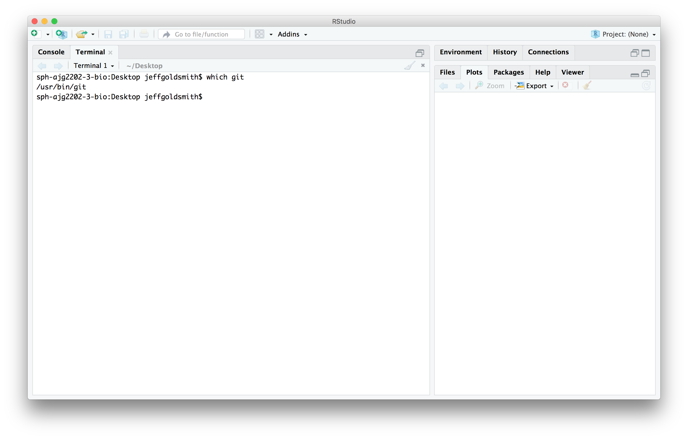

### Context

R and RStudio are required for this course, as are several R packages. Additionally, we will make extensive use of Git and Github. The goal of this homework assignment is to ensure that you have installed relevant software and packages. 

### Due date

Due: September 6 at 10:00am. 

### Problem 1

Download and install the latest versions of [R](https://cran.r-project.org) (3.5.1) and [RStudio](https://www.rstudio.com/products/rstudio/download/) (1.1.456). 

Install several packages (and their dependencies) using the code below:

```{r eval = FALSE}
install.packages(c("tidyverse", "knitr", "janitor", "broom", "here", "shiny", "readxl", "haven", "rnoaa", "ggridges", "viridis", "skimr", "rvest", "httr", "flexdashboard", "devtools", "rmarkdown", "modelr", "mgcv"))
```

Upload a screenshot of RStudio that shows your R version and that you can successfully load the packages `tidyverse` and `knitr`; include your UNI on the command line. Here's an example "solution":


### Problem 2

Install Git on the machine you'll use for work in this course. There are several installation approaches; I suggest you follow [this guide](http://happygitwithr.com/install-git.html).

Upload a screenshot of RStudio's terminal pane that shows a successful execution of `which git`. Here's an example "solution":



### Problem 3

Create a user account on GitHub, and submit your user name using [this google form](https://docs.google.com/forms/d/e/1FAIpQLSf-BnbRDsen2y2Bv9corM4PWmDGfzx1ZJB77uJTrSqVqybQBA/viewform?usp=sf_link).

